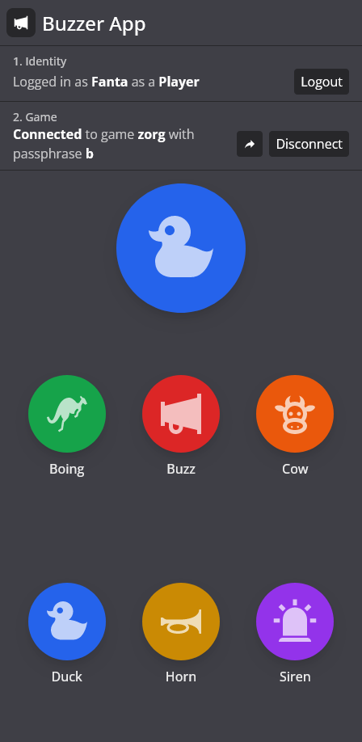
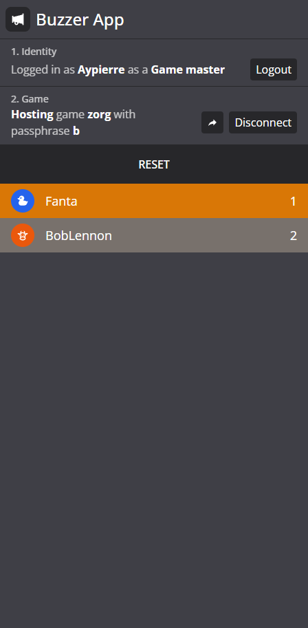

<h1 align="center">
   Buzzer App
</h1>

<h4 align="center">Homemade buzzer app with a mix of good tech</h4>

<table align="center"><tr>
  <td align="center"><em>Player side</em><br>
    
  </td>
  <td align="center"><em>Game master side</em><br>
    
  </td>
</tr></table>

## Technologies

Front-end: **SvelteKit** combined with **typescript** for the framework, with **Tailwind CSS** and **SCSS** for dynamic styles using `@apply` and `mixins`.

Back-end: **SvelteKit** does the job quickly but it's really **express** and **socket.io** that brings the power for a custom production server allowing advanced routing and sockets together.

## Base project

I used **[8ctopotamus/sveltekit-socketio-chat](https://github.com/8ctopotamus/sveltekit-socketio-chat)** repo as a base and scratched the entire content to build my app on top. I won so much time over the overall setup time.

## How to develop

Install packages with your favorite package manager. I use [pnpm](https://pnpm.io/) to cache my downloaded packages and go faster:

```
pnpm install
```

You can then start the development server:

```
pnpm run dev
```

Open hosts with `--host` to expose your dev server on the network:

```
pnpm run dev --host 0.0.0.0
```

## How to build

To create a production version of your app:

```bash
pnpm run build
```

## Start prod server

To start prod server, you need to run the built production version:

```
node build/index.prod.js
```
or
```
npm run prod
```

 You can use environment variables like `HOST`, `PORTS` and `SOCKET_PATH` to personalize exposed network interface and port.
